<h2>TensorFlow-FlexUNet-Image-Segmentation-Soft-Tissue-Sarcomas (2026/01/19)</h2>
<h3>Revisiting Aerial Semantic Segmentation (Soft-Tissue-Sarcomas)</h3>
Toshiyuki Arai 
Software Laboratory antillia.com  
This is the first experiment of Image Segmentation for Soft-Tissue-Sarcomas 
based on our <a href="./src/TensorFlowFlexUNet.py">TensorFlowFlexUNet</a> (TensorFlow Flexible UNet Image Segmentation Model for Multiclass) , 
and a 512x512 pixels Upscaled<a href="https://drive.google.com/file/d/1naVbtgWJExGRz3eaSUPztCePQ-6Z8lSH/view?usp=sharing">
<b>Augmented-Soft-Tissue-Sarcomas-CTPET-ImageMask-Dataset.zip</b></a>, which was derived by us from
<a href="https://www.kaggle.com/datasets/4quant/soft-tissue-sarcoma/data">
<b>Segmenting Soft Tissue Sarcomas</b></a> on the kaggle web site.
  
<b>Data Augmentation Strategy</b> 
To address the limited size of images and masks of the original 
<a href="https://www.kaggle.com/datasets/4quant/soft-tissue-sarcoma/data">
<b>Segmenting Soft Tissue Sarcomas</b></a>,
we used our offline augmentation tool 

<a href="./generator/ImageMaskDatasetGenerator.py"> 
ImageMaskDatasetGenerator.py</a> (see also <a href="https://github.com/sarah-antillia/Image-Distortion-Tool">Image-Distortion-Tool</a>)

to generate the Augmented dataset from <b>lab_petct_vox_5.00mm.h5</b> file in the original dataset.
   

<b>Actual Image Segmentation for Soft-Tissue-Sarcomas Images of 512x512 pixels</b> 
As shown below, the inferred masks look similar to the ground truth masks, but they lack precision in certain areas.   
 
<table>
<tr>
<th>Input: image</th>
<th>Mask (ground_truth)</th>
<th>Prediction: inferred_mask</th>
</tr>
<tr>
<td>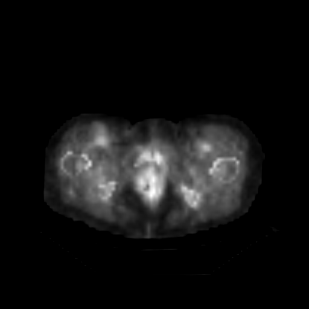</td>
<td></td>
<td></td>
</tr>

<tr>
<td>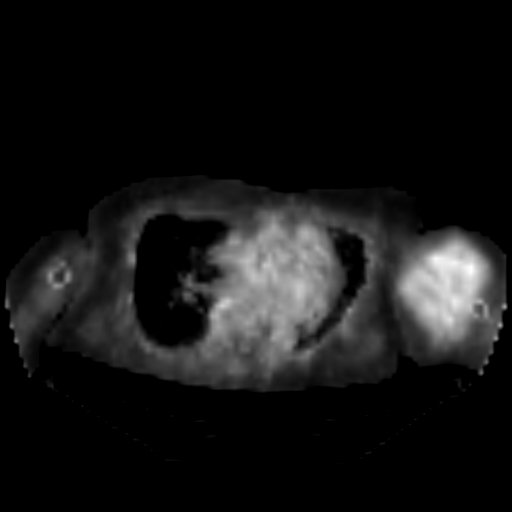</td>
<td></td>
<td></td>
</tr>

<tr>
<td>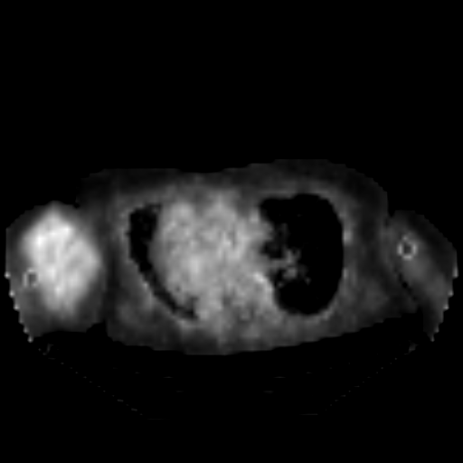</td>
<td></td>
<td></td>
</tr>
</table>

 
<h3>1  Dataset Citation</h3>
The dataset used here was derived from:  
<a href="https://www.kaggle.com/datasets/4quant/soft-tissue-sarcoma/data">
<b>Segmenting Soft Tissue Sarcomas</b></a> on the kaggle web site.
  
<b>About Dataset</b> 
<b>Summary</b> 
Summary
The data is a preprocessed subset of the TCIA Study named Soft Tissue Sarcoma. The data have been converted from DICOM folders of varying resolution 
and data types to 3D HDF5 arrays with isotropic voxel size.  
This should make it easier to get started and test out various approaches (NN, RF, CRF, etc) to improve segmentations.
  
<b>TCIA Summary</b> 
This collection contains FDG-PET/CT and anatomical MR (T1-weighted, T2-weighted with fat-suppression) imaging data from 51 patients with histologically proven soft-tissue sarcomas (STSs) of the extremities. All patients had pre-treatment FDG-PET/CT and MRI scans between November 2004 and November 2011. (Note: date in the TCIA images have been changed in the interest of de-identification; the same change was applied across all images, preserving the time intervals between serial scans). During the follow-up period, 19 patients developed lung metastases. Imaging data and lung metastases development status were used in the following study:

  
Vallières, M. et al. (2015). A radiomics model from joint FDG-PET and MRI texture features for the prediction of lung metastases in soft-tissue sarcomas of the extremities. Physics in Medicine and Biology, 60(14), 5471-5496. doi:10.1088/0031-9155/60/14/5471.
  
Imaging data, tumor contours (RTstruct DICOM objects), clinical data and source code is available for this study. See the DOI below for more details and links to access the whole dataset. Please contact Martin Vallières (mart.vallieres@gmail.com) of the Medical Physics Unit of McGill University for any scientific inquiries about this dataset.
  
<b>Data Citation</b> 
Vallières, Martin, Freeman, Carolyn R., Skamene, Sonia R., & El Naqa, Issam. (2015).  
A radiomics model from joint FDG-PET and MRI texture features for the prediction of lung 
metastases in soft-tissue sarcomas of the extremities. 
 The Cancer Imaging Archive. 
 <a href="  http://doi.org/10.7937/K9/TCIA.2015.7GO2GSKS">
 http://doi.org/10.7937/K9/TCIA.2015.7GO2GSKS
</a>
  
<b>Publication Citation</b> 
Vallières, M., Freeman, C. R., Skamene, S. R., & Naqa, I. El. (2015, June 29). 
A radiomics model from joint FDG-PET and MRI texture features for the prediction of lung metastases
 in soft-tissue sarcomas of the extremities.  
 Physics in Medicine and Biology. IOP Publishing.
 <a href="http://doi.org/10.1088/0031-9155/60/14/5471"> http://doi.org/10.1088/0031-9155/60/14/5471
 </a>
  
<b>TCIA Citation</b> 
Clark K, Vendt B, Smith K, Freymann J, Kirby J, Koppel P, Moore S, Phillips S, Maffitt D, Pringle M, Tarbox L, 
Prior F.  
The Cancer Imaging Archive (TCIA): Maintaining and Operating a Public Information Repository, Journal of Digital Imaging,  
Volume 26, Number 6, December, 2013, pp 1045-1057. (paper)
  
<b>License</b> 
This collection is freely available to browse, download, and use for commercial, scientific and educational purposes  
as outlined in the 
<a href="https://spdx.org/licenses/preview/CC-BY-3.0.html">Creative Commons Attribution 3.0 Unported License.</a>
  
See TCIA's Data Usage Policies and Restrictions for additional details. Questions may be directed to help@cancerimagingarchive.net.
 
 
<h3>
2 Soft-Tissue-Sarcomas ImageMask Dataset
</h3>
 If you would like to train this Soft-Tissue-Sarcomas Segmentation model by yourself,
 please download the original dataset from the google drive  
<a href="https://drive.google.com/file/d/1naVbtgWJExGRz3eaSUPztCePQ-6Z8lSH/view?usp=sharing">
<b>Augmented-Soft-Tissue-Sarcomas-CTPET-ImageMask-Dataset.zip</b></a>
, expand the downloaded, and put it under <b>./dataset </b> folder to be: 
<pre>
./dataset
└─Soft-Tissue-Sarcomas
    ├─test
    │   ├─images
    │   └─masks
    ├─train
    │   ├─images
    │   └─masks
    └─valid
        ├─images
        └─masks
</pre>
 
<b>Soft-Tissue-Sarcomas Statistics</b> 
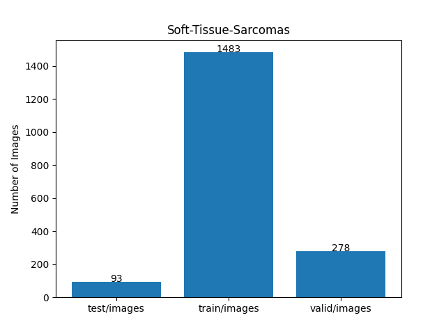 
 
As shown above, the number of images of train and valid datasets is not enough to use for a training set of our segmentation model.
 
 
<b>Train_images_sample</b> 
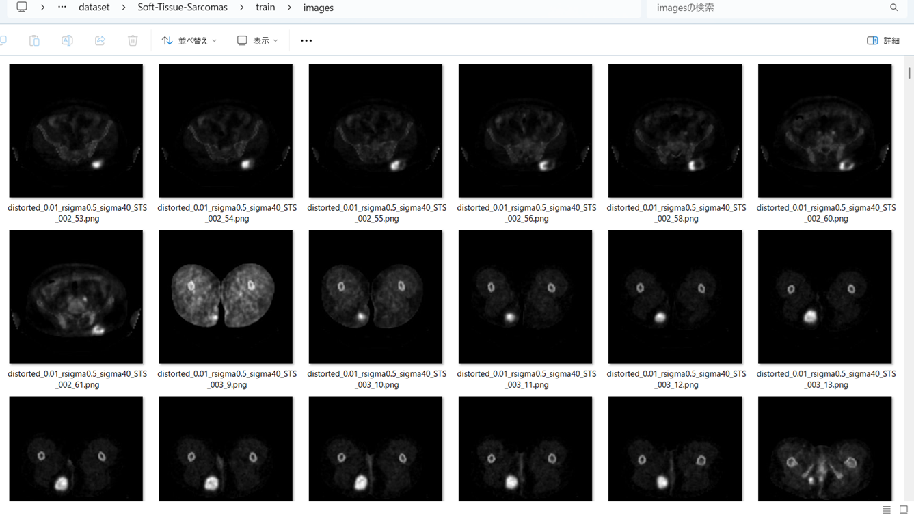
 
<b>Train_masks_sample</b> 
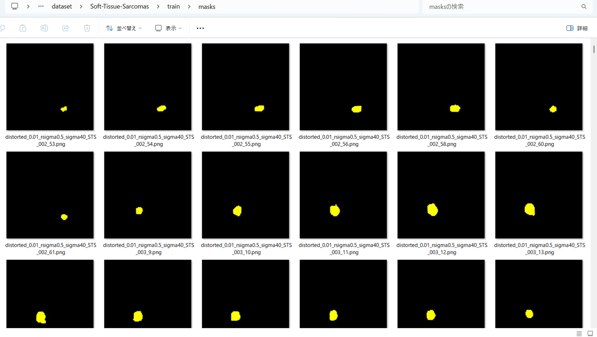
 

<h3>
3 Train TensorflowFlexUNet Model
</h3>
 We trained Soft-Tissue-Sarcomas TensorflowFlexUNet Model by using the following
<a href="./projects/TensorFlowFlexUNet/Soft-Tissue-Sarcomas/train_eval_infer.config"> <b>train_eval_infer.config</b></a> file.  
Please move to ./projects/TensorFlowFlexUNet/Soft-Tissue-Sarcomas and run the following bat file. 
<pre>
>1.train.bat
</pre>
, which simply runs the following command. 
<pre>
>python ../../../src/TensorFlowFlexUNetTrainer.py ./train_eval_infer.config
</pre>

<b>Model parameters</b> 
Defined a small <b>base_filters=16</b> and a large <b>base_kernels=(11,11)</b> for the first Conv Layer of Encoder Block of 
<a href="./src/TensorflowUNet.py">TensorflowUNet.py</a> 
and a large num_layers (including a bridge between Encoder and Decoder Blocks).
<pre>
[model]
image_width    = 512
image_height   = 512
image_channels = 3
input_normalize = True
normalization  = False

num_classes    = 2

base_filters   = 16
base_kernels   = (11,11)
num_layers     = 8

dropout_rate   = 0.04
dilation       = (1,1)
</pre>

<b>Learning rate</b> 
Defined a small learning rate.  
<pre>
[model]
learning_rate  = 0.00007
</pre>

<b>Loss and metrics functions</b> 
Specified "categorical_crossentropy" and "dice_coef_multiclass". 
<pre>
[model]
loss           = "categorical_crossentropy"
metrics        = ["dice_coef_multiclass"]
</pre>
<b >Learning rate reducer callback</b> 
Enabled learing_rate_reducer callback, and a small reducer_patience.
<pre> 
[train]
learning_rate_reducer = True
reducer_factor     = 0.5
reducer_patience   = 4
</pre>
<b>Early stopping callback</b> 
Enabled early stopping callback with patience parameter.
<pre>
[train]
patience      = 10
</pre>
<b></b> 
<b>RGB color map</b> 
rgb color map dict for Soft-Tissue-Sarcomas 1+1 classes. 
<pre>
[mask]
mask_file_format = ".png"
;Soft-Tissue-Sarcomas 1+1
;                      yellow
rgb_map={(0,0,0):0, (255, 255, 0):1,}
</pre>
<b>Epoch change inference callbacks</b> 
Enabled epoch_change_infer callback. 
<pre>
[train]
epoch_change_infer       = True
epoch_change_infer_dir   =  "./epoch_change_infer"
epoch_changeinfer        = False
epoch_changeinfer_dir    = "./epoch_changeinfer"
num_infer_images         = 6
</pre>
By using this epoch_change_infer callback, on every epoch_change, the inference procedure can be called
 for 6 images in <b>mini_test</b> folder. This will help you confirm how the predicted mask changes 
 at each epoch during your training process.    
<b>Epoch_change_inference output at starting (1,2,3)</b> 
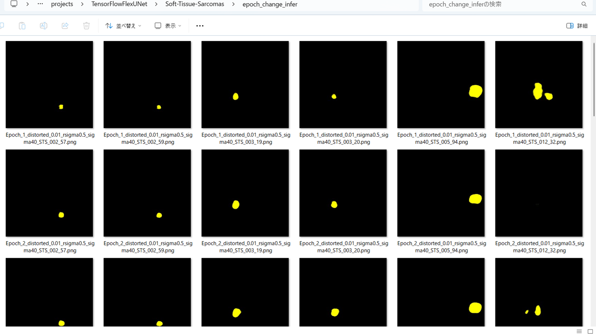 
 
<b>Epoch_change_inference output at ending (23,24,25)</b> 
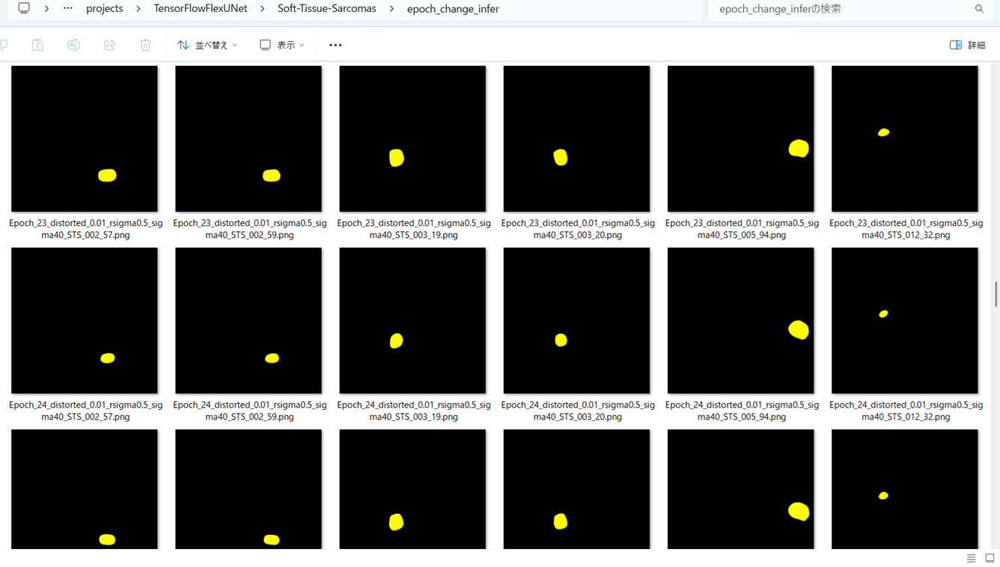 
 
<b>Epoch_change_inference output at ending (48,49,50)</b> 
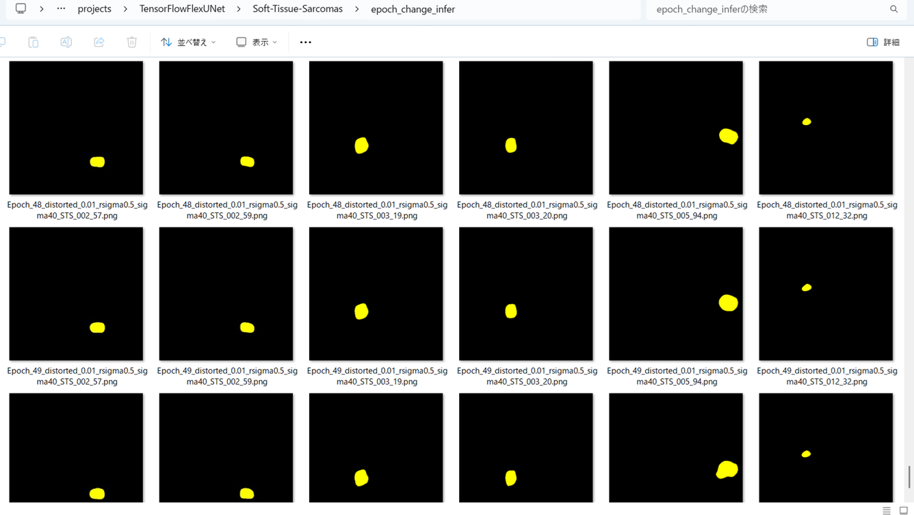 

 
In this experiment, the training process was terminated at epoch 50.  
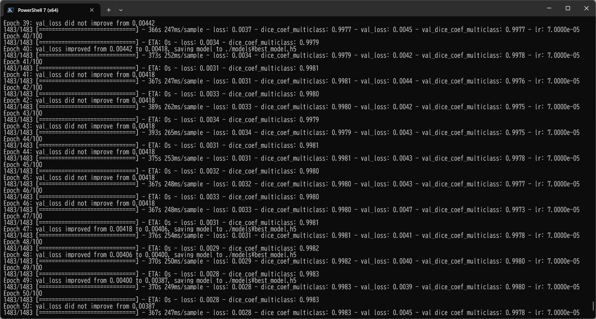 
 
<a href="./projects/TensorFlowFlexUNet/Soft-Tissue-Sarcomas/eval/train_metrics.csv">train_metrics.csv</a> 
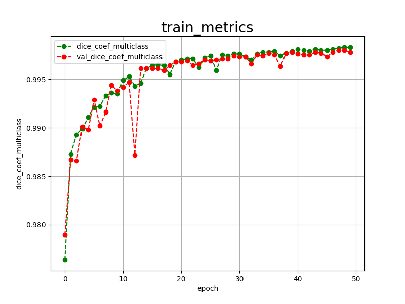 

 
<a href="./projects/TensorFlowFlexUNet/Soft-Tissue-Sarcomas/eval/train_losses.csv">train_losses.csv</a> 
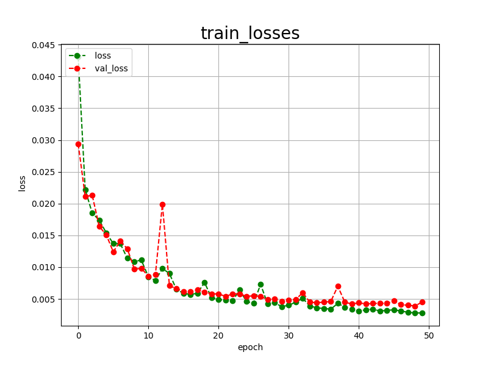 
 
<h3>
4 Evaluation
</h3>
Please move to a <b>./projects/TensorFlowFlexUNet/Soft-Tissue-Sarcomas</b> folder, 
and run the following bat file to evaluate TensorflowFlexUNet model for Soft-Tissue-Sarcomas. 
<pre>
>./2.evaluate.bat
</pre>
This bat file simply runs the following command.
<pre>
>python ../../../src/TensorFlowFlexUNetEvaluator.py  ./train_eval_infer.config
</pre>
Evaluation console output: 
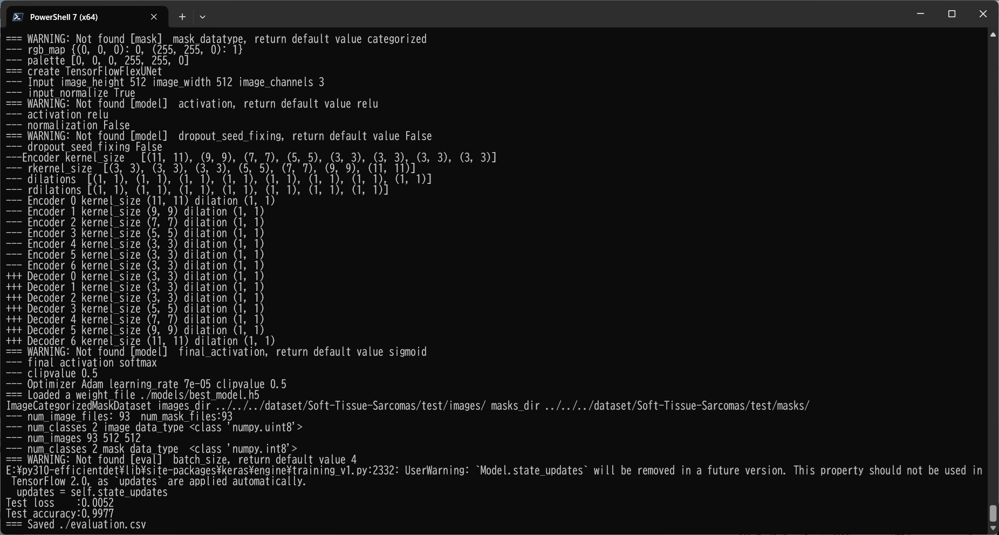
  Image-Segmentation-Soft-Tissue-Sarcomas
<a href="./projects/TensorFlowFlexUNet/Soft-Tissue-Sarcomas/evaluation.csv">evaluation.csv</a> 
The loss (categorical_crossentropy) to this Soft-Tissue-Sarcomas/test was very low, and dice_coef_multiclass veryhigh as shown below.
 
<pre>
categorical_crossentropy,0.0052
dice_coef_multiclass,0.9977
</pre>
 
<h3>5 Inference</h3>
Please move to a <b>./projects/TensorFlowFlexUNet/Soft-Tissue-Sarcomas</b> folder 
,and run the following bat file to infer segmentation regions for images by the Trained-TensorflowFlexUNet model for Soft-Tissue-Sarcomas. 
<pre>
>./3.infer.bat
</pre>
This simply runs the following command.
<pre>
>python ../../../src/TensorFlowFlexUNetInferencer.py ./train_eval_infer.config
</pre>

<b>mini_test_images</b> 
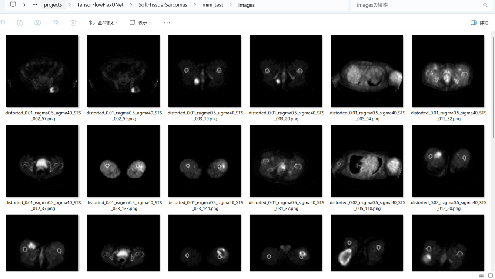 
<b>mini_test_mask(ground_truth)</b> 
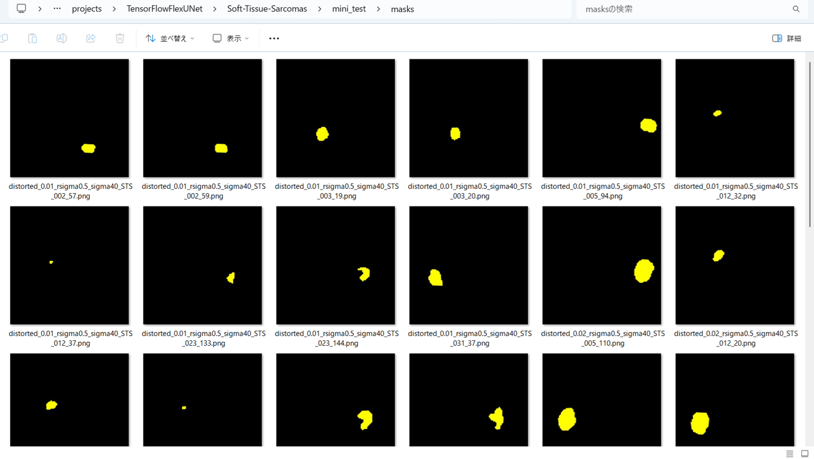 

<b>Inferred test masks</b> 
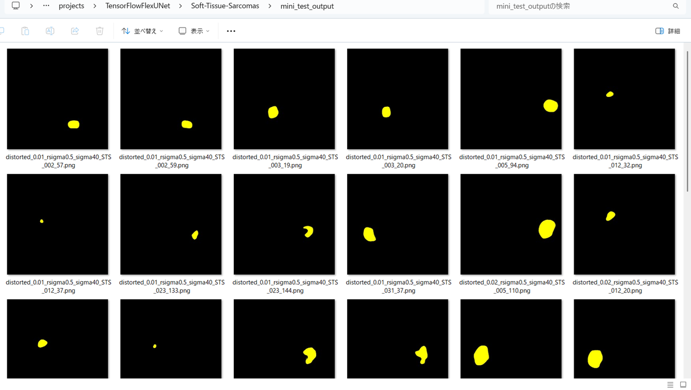 
 

<b>Enlarged images and masks for Soft-Tissue-Sarcomas Images of 512x512 pixels</b> 
As shown below, the inferred masks predicted by our segmentation model trained on the dataset appear similar to the ground truth masks.
 
 
<table>
<tr>
<th>Input: image</th>
<th>Mask (ground_truth)</th>
<th>Prediction: inferred_mask</th>
</tr>
<tr>
<td>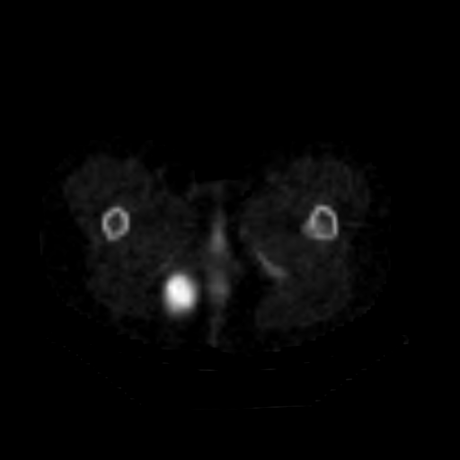</td>
<td></td>
<td></td>
</tr>

<tr>
<td>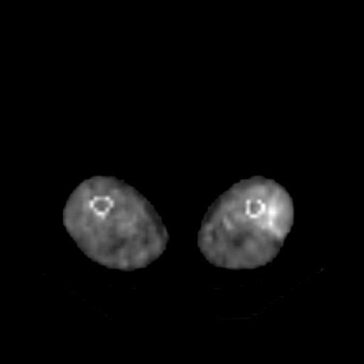</td>
<td></td>
<td></td>
</tr>

<tr>
<td>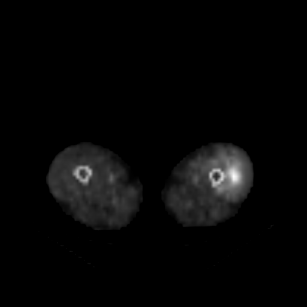</td>
<td></td>
<td></td>
</tr>
<tr>
<td></td>
<td></td>
<td></td>
</tr>
<tr>
<td>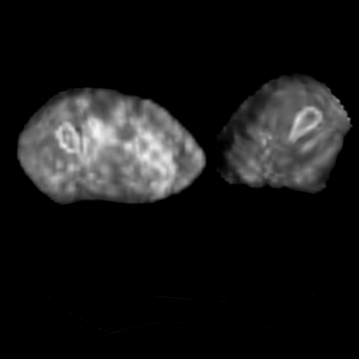</td>
<td></td>
<td></td>
</tr>
<tr>
<td>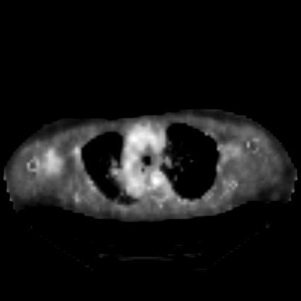</td>
<td></td>
<td></td>
</tr>
</table>

 
<h3>
References
</h3>
<b>1. Segmentation model of soft tissue sarcoma based on self-supervised learning</b> 
Minting Zheng, Chenhua Guo, Yifeng Zhu,  Xiaoming Gang, Chongyang Fu, Shaowu Wang 
<a href="https://www.frontiersin.org/journals/oncology/articles/10.3389/fonc.2024.1247396/full">
https://www.frontiersin.org/journals/oncology/articles/10.3389/fonc.2024.1247396/full</a>
  
<b>2. Soft Tissue Sarcoma Co-Segmentation in Combined MRI and PET/CT Data</b> 
Theresa Neubauer, Maria Wimmer, Astrid Berg, David Major, Dimitrios 
Lenis, Thomas Beyer, Jelena Saponjski, and Katja B¨uhler 
<a href="https://arxiv.org/pdf/2008.12544">
https://arxiv.org/pdf/2008.12544
</a>
 
 
<b>3. TensorFlow-FlexUNet-Image-Segmentation-Model</b> 
Toshiyuki Arai  
<a href="https://github.com/sarah-antillia/TensorFlow-FlexUNet-Image-Segmentation-Model">
https://github.com/sarah-antillia/TensorFlow-FlexUNet-Image-Segmentation-Model
</a>
 
 
